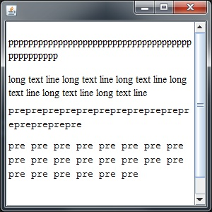

# Java swing html paragraph wrap

By default there are some issues with long text displaying in html page loaded into _JEditorPane_.
1. content of the pre-blocks is not wrapped at all;
2. long like super long word or symbol seqence is not wrapped anywhere.

One extra issue: how to wrap a text in _JEditorPane_ inside _JScrollPane_ if we don't need to use horizontal scroll bar?

Let's start from the ending:
- just override method _JEditorPane.getScrollableTracksViewportWidth_ and put _"return true;"_ inside.

For the first two issues we need to override classes _javax.swing.text.html.HTMLEditorKit_ and _javax.swing.text.html.ParagraphView_.

Our _HTMLEditorKit_ should just return an object of our _ParagraphView_ for specific tags.

Custom _ParagraphView_ should return 0 in the method _getMinimumSpan_ for X-axis.
